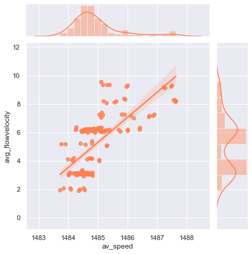

# Ultrasonic Flowmeter Fault Detection : Project Overview 

## Project Outline - 
- The underlying motive of this project is to **solve the problem of frequent Power Cuts in TamilNadu** .The problem stated ( ) was observed my me during my visit to **TAQA Neyveli Power Company as an Inplant Trainee in the month of January-2020**.
- Visualized the problem of overfitting by calculating the tradeoff between dev & test sets . **Generation of Gaussian Noise** & **Feature creation** were done to solve the same .
- Performed EDA (Exploratory Data Analysis) to identify the **problem of outliers & Skewness** . Key decisions were made to resolve them . 
- Ran over 11 models to see which performs better . 
- Built a client facing API using the following : 1. Streamlit - Local webserver & 2. Heroku - Cloud 

## Data Cleaning - 
Ran a preliminary model to see whether the model was overfitting or not . Yes , the model had overfit & this was evident from the **tradeoff score** .The following solutions were devised & performed :
- Dropped speeds along all paths since a column signifying **Average speed** was already present .
- Created a new feature signifying **Average flowvelocity** as the mean taken along all the subpaths under all paths .
- Created a new feature signifying **Average gain** as the mean taken along all the subpaths under all paths .
- Data augmentation by generating **Gaussian Noise** & **Random sampling** were performed . Gaussian Noise was set & generated between mu=0 & sigma=0.1 by choosing a random number within the constraints.

## EDA (Exploratory Data Analysis) - 
I looked at the distributions of the data and the value counts for the various categorical variables. Below are a few highlights from the analysis .

  	

## Model Building & Model Performance - 
- First, I transformed the categorical variables into dummy variables. I also split the data into train and tests sets with a test size of 20% . 
- The Evaluation metric chosen was **F1 Score** because it has the **combination of both Precision & Recall with which we will quote our solution to the problem** . 
- Below are the cross-validation scores for different models :

## Productionization - 
In this step, I built a Streamlit app which was hosted on a local webserver by following along with the Youtube videos in the reference section above. The app takes in a request with a list of values from the meter and returns an approximate prediction class . Furthermore the app is hosted on the cloud via the Heroku platform for multiple access all across the company . 
